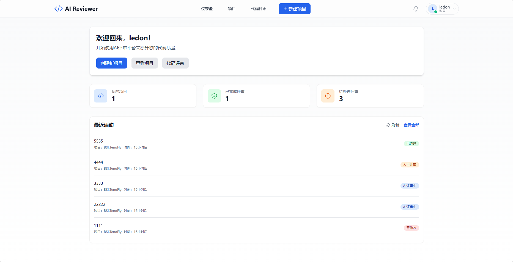
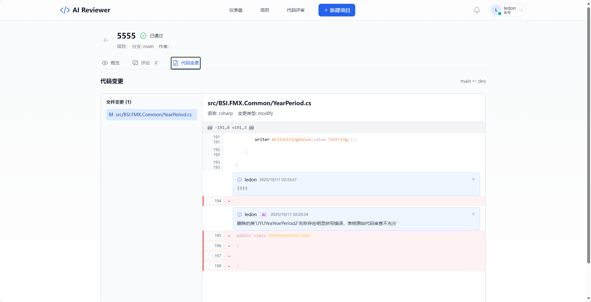

AIReview — AI-Powered Code Review Platform
============================================

English | [简体中文](docs/README.zh-cn.md)

## 🎯 Overview

AIReview is an enterprise-grade AI-powered code review platform that transforms the code review process through intelligent automation. Built with a modern microservices-inspired architecture, it combines multi-LLM support, real-time collaboration, and sophisticated analysis capabilities to deliver actionable insights and significantly improve code quality.

**Vision**: Empower development teams to deliver high-quality code faster by augmenting human review with AI-driven intelligence.

## 🏗️ Architecture Design

### System Architecture

AIReview follows a **layered clean architecture** with clear separation of concerns:

```
┌─────────────────────────────────────────────────────────────┐
│                    Frontend Layer (React)                    │
│  • React 19 + TypeScript + Vite                             │
│  • Real-time updates via SignalR                            │
│  • State management with React Query                        │
└────────────────────────┬────────────────────────────────────┘
                         │ REST API / SignalR
┌────────────────────────┴────────────────────────────────────┐
│              API Layer (ASP.NET Core Web API)               │
│  • Controllers (Authentication, Projects, Reviews)          │
│  • SignalR Hubs (Real-time notifications)                  │
│  • Middleware (Auth, Error handling, Logging)              │
└────────────────────────┬────────────────────────────────────┘
                         │
┌────────────────────────┴────────────────────────────────────┐
│                 Core Business Logic Layer                    │
│  • Domain Entities (Project, Review, User, Prompt, etc.)   │
│  • Service Interfaces (AI, Git, Project, Analysis)         │
│  • Business Services (Orchestration & Domain logic)         │
└────────────────────────┬────────────────────────────────────┘
                         │
┌────────────────────────┴────────────────────────────────────┐
│              Infrastructure Layer                            │
│  • Data Access (EF Core + Repository Pattern)               │
│  • External Services (Multi-LLM providers, Git)             │
│  • Background Jobs (Async analysis via Hangfire)            │
│  • Caching & Session Management (Redis)                     │
└────────────────────────┬────────────────────────────────────┘
                         │
                  ┌──────┴──────┐
                  │   Database   │
                  │  (SQLite/PG) │
                  └──────────────┘
```

### Key Architecture Principles

1. **Separation of Concerns**: Each layer has distinct responsibilities
   - API layer handles HTTP/SignalR communication
   - Core layer contains pure business logic
   - Infrastructure layer manages external dependencies

2. **Dependency Inversion**: Core logic depends on abstractions (interfaces), not implementations

3. **Repository & Unit of Work Pattern**: Consistent data access with transaction support

4. **Async Processing**: Background jobs handle long-running AI analysis tasks

5. **Real-time Communication**: SignalR enables push notifications for review updates

### Module Responsibilities

| Module | Responsibility | Key Components |
|--------|---------------|----------------|
| **AIReview.API** | Entry point, request handling, real-time hubs | Controllers, SignalR Hubs, Middleware |
| **AIReview.Core** | Business rules, domain models, service contracts | Entities, Interfaces, Domain Services |
| **AIReview.Infrastructure** | Data persistence, external integrations, background jobs | Repositories, EF Core, Hangfire, LLM clients |
| **AIReview.Shared** | Cross-cutting concerns, DTOs | Data Transfer Objects, Enums |
| **AIReview.Tests** | Quality assurance | Unit tests, Integration tests |
| **aireviewer-frontend** | User interface, client-side logic | React components, API clients |

For detailed architecture documentation, see:
- [English Design Doc](docs/design.en-us.md)
- [中文设计文档](docs/design.md)

## 🚀 Core Features

### 1. **Intelligent AI Code Review**
- **Multi-dimensional Analysis**: Quality, security, performance, maintainability assessments
- **Risk Scoring System**: Automated risk evaluation across multiple dimensions
  - Complexity analysis (cyclomatic complexity, nesting depth)
  - Security vulnerability detection
  - Performance bottleneck identification
  - Maintainability metrics
- **Contextual Suggestions**: AI generates targeted improvement recommendations
- **Multi-LLM Support**: Configurable providers (OpenAI, Azure OpenAI, custom models)
- **Async Processing**: Background jobs ensure responsive UX for large codebases

### 2. **Customizable Prompt Management** ⭐ NEW
- **3-Tier Template System**: Built-in → User-level → Project-level overrides
- **Template Types**:
  - Code Review templates
  - Risk Analysis templates
  - Pull Request Summary templates
  - Improvement Suggestion templates
- **Flexible Placeholders**: {{CONTEXT}}, {{DIFF}}, {{FILE_NAME}}, etc.
- **UI Management**: Intuitive web interface for template CRUD operations

### 3. **Advanced Pull Request Analysis**
- **Intelligent Change Summaries**: AI-generated PR descriptions with impact analysis
- **Change Type Classification**: Feature, Bug Fix, Refactoring, Documentation, etc.
- **Impact Assessment**:
  - Business impact evaluation
  - Technical debt analysis
  - Breaking change detection
- **Test Recommendations**: Auto-generated testing focus areas
- **Deployment Notes**: Risk assessments and rollback considerations

### 4. **Improvement Suggestion Engine**
- **Categorized Suggestions**: Code quality, performance, security, architecture, etc.
- **Priority Scoring**: Automated prioritization based on impact and effort
- **User Feedback Loop**: Accept/Ignore tracking for continuous improvement
- **Historical Tracking**: Monitor suggestion acceptance rates over time

### 5. **Git Integration**
- **Repository Import**: Clone and analyze existing Git repositories
- **Diff Analysis**: Intelligent parsing of code changes
- **Commit History**: Track review history alongside Git commits
- **Branch Support**: Work with multiple branches seamlessly

### 6. **Project & Team Management**
- **Project Organization**: Create and manage multiple review projects
- **Role-Based Access Control**: Owner, Reviewer, Developer roles
- **Member Management**: Invite team members with granular permissions
- **Project Settings**: Per-project configurations and preferences

### 7. **Real-time Collaboration**
- **Live Notifications**: SignalR-powered instant updates
- **Review Comments**: Threaded discussions on code changes
- **Status Tracking**: Real-time review workflow status updates
- **Activity Feed**: Team activity visibility

### 8. **Review Workflow**
- **Review Request Management**: Create, assign, and track reviews
- **Approval Process**: Approve, reject, or request changes
- **Status Lifecycle**: Pending → In Review → Approved/Rejected
- **Comment System**: Line-by-line and general feedback

## 📊 Screenshots





## Repository Structure

- **AIReview.API**: ASP.NET Core Web API backend with controllers, hubs, and service configuration
- **AIReview.Core**: Core business logic with entity models, service interfaces, and business services  
- **AIReview.Infrastructure**: Infrastructure layer with EF Core data access, repository pattern, and background jobs
- **AIReview.Shared**: Shared Data Transfer Objects (DTOs) and enums
- **AIReview.Tests**: Unit tests and integration tests
- **aireviewer-frontend**: React + TypeScript frontend application built with Vite
- **docs**: Project documentation and design specifications

## 🛠️ Tech Stack

### Backend Architecture
- **.NET 8.0**: Latest cross-platform framework with performance improvements
- **ASP.NET Core Web API**: RESTful API with OpenAPI/Swagger documentation
- **Entity Framework Core**: Code-first ORM with migration support
- **ASP.NET Core Identity**: JWT-based authentication and authorization
- **SignalR**: WebSocket-based real-time bidirectional communication
- **Hangfire**: Background job processing for async AI analysis
- **SQLite/PostgreSQL**: Flexible database options (dev/production)
- **Redis**: Distributed caching and session management (optional)

### Frontend Architecture
- **React 19**: Latest React with concurrent features
- **TypeScript**: Type-safe development with full IntelliSense
- **Vite**: Lightning-fast HMR and optimized production builds
- **TailwindCSS**: Utility-first CSS with custom design system
- **React Query (@tanstack/react-query)**: Powerful server state management
- **React Router v6**: Declarative client-side routing
- **Axios**: Promise-based HTTP client with interceptors
- **Heroicons**: Beautiful hand-crafted SVG icons

### Infrastructure & DevOps
- **Docker**: Containerization for consistent environments
- **Docker Compose**: Multi-container orchestration for local dev
- **GitHub Actions**: CI/CD pipelines (planned)
- **Kubernetes**: Production orchestration (planned)

## 📁 Repository Structure

```
AIReview/
├── AIReview.API/              # Web API entry point
│   ├── Controllers/           # REST API endpoints
│   ├── Hubs/                  # SignalR real-time hubs
│   ├── Services/              # API-layer services
│   └── Program.cs             # App configuration & DI
│
├── AIReview.Core/             # Domain & business logic
│   ├── Entities/              # Domain models (EF Core entities)
│   ├── Interfaces/            # Service contracts & abstractions
│   └── Services/              # Business logic implementations
│
├── AIReview.Infrastructure/   # External dependencies
│   ├── Data/                  # EF Core DbContext & configurations
│   ├── Repositories/          # Data access implementations
│   ├── Services/              # External service integrations
│   ├── BackgroundJobs/        # Hangfire job definitions
│   └── Migrations/            # EF Core database migrations
│
├── AIReview.Shared/           # Cross-cutting concerns
│   ├── DTOs/                  # Data transfer objects
│   └── Enums/                 # Shared enumerations
│
├── AIReview.Tests/            # Test suite
│   └── Services/              # Unit & integration tests
│
├── aireviewer-frontend/       # React frontend
│   ├── src/
│   │   ├── components/        # Reusable UI components
│   │   ├── pages/             # Route-level page components
│   │   ├── services/          # API client services
│   │   ├── types/             # TypeScript type definitions
│   │   └── App.tsx            # Root component & routing
│   └── vite.config.ts         # Vite build configuration
│
└── docs/                      # Documentation
    ├── design.md              # Architecture design (中文)
    ├── design.en-us.md        # Architecture design (English)
    └── features/              # Feature-specific docs
```

## ⚙️ Prerequisites

- **.NET SDK 8.0+**: [Download](https://dotnet.microsoft.com/download)
- **Node.js 18+** and **npm/pnpm**: [Download](https://nodejs.org/)
- **SQLite** (default) or **PostgreSQL 14+** (optional for production)
- **Redis** (optional, for distributed caching): [Download](https://redis.io/download)
- **Docker Desktop** (optional, for containerized development): [Download](https://www.docker.com/products/docker-desktop)

## � Quick Start

### Backend Setup

1. **Clone the Repository**:
   ```bash
   git clone https://github.com/wosledon/AIReview.git
   cd AIReview
   ```

2. **Configure Application Settings**: Edit `AIReview.API/appsettings.Development.json`:
   ```json
   {
     "ConnectionStrings": {
       "DefaultConnection": "Data Source=aireviewer.db",  // SQLite
       "Redis": "localhost:6379"
     },
     "Jwt": {
       "Secret": "YourJWTSecretKey(AtLeast32Characters)",
       "Issuer": "AIReview", 
       "Audience": "AIReview"
     }
   }
   ```

3. **Apply Database Migrations**:
   ```bash
   cd AIReview.API
   dotnet ef database update
   ```

4. **Start API Service**:
   ```bash
   dotnet run
   # API will be available at http://localhost:5000
   # Swagger UI: http://localhost:5000/swagger
   ```

### Frontend Setup

1. **Install Dependencies**:
   ```bash
   cd aireviewer-frontend
   npm install
   ```

2. **Configure Environment Variables**: Create `.env` file:
   ```env
   VITE_API_BASE_URL=http://localhost:5000/api/v1
   ```

3. **Start Development Server**:
   ```bash
   npm run dev
   # Frontend will be available at http://localhost:5173
   ```

## 🧪 Testing

### Backend Tests
```bash
cd AIReview.Tests
dotnet test --verbosity normal
```

### Frontend Tests
```bash
cd aireviewer-frontend
npm run test  # Configure Vitest/Jest as needed
```

## 📦 Deployment

### Docker Deployment

1. **Build Docker Images**:
   ```bash
   # Backend
   docker build -t aireviewer-api -f AIReview.API/Dockerfile .
   
   # Frontend
   docker build -t aireviewer-frontend -f aireviewer-frontend/Dockerfile .
   ```

2. **Run with Docker Compose**:
   ```bash
   docker-compose up -d
   ```

### Production Considerations
- Use PostgreSQL instead of SQLite for production
- Configure Redis for distributed caching and session management
- Set up HTTPS with reverse proxy (Nginx/Traefik)
- Enable CORS only for trusted origins
- Use environment variables for secrets (never commit credentials)
- Configure logging and monitoring (Application Insights, Serilog, etc.)
- Set up backup strategies for database

## 🔒 Security

- **Authentication**: JWT-based with refresh token support
- **Authorization**: Role-based access control (RBAC)
- **Data Protection**: ASP.NET Core Data Protection for sensitive data
- **Input Validation**: Model validation and sanitization
- **Rate Limiting**: API throttling to prevent abuse
- **HTTPS**: Enforce TLS 1.2+ in production
- **CORS**: Restricted to allowed origins
- **SQL Injection**: Parameterized queries via EF Core

## 🗺️ Roadmap & Future Enhancements

### 🔥 Near-term (Next 3-6 months)

#### Enhanced AI Capabilities
- [ ] **Advanced Code Fix Suggestions**: AI-generated code patches with diff preview
- [ ] **Multi-Model Ensemble**: Combine multiple LLM responses for higher accuracy
- [ ] **Context-Aware Analysis**: Learning from historical reviews to improve suggestions
- [ ] **Custom AI Model Fine-tuning**: Support for organization-specific model training

#### Integration Ecosystem
- [ ] **GitHub/GitLab Webhooks**: Automatic review triggers on PR creation
- [ ] **VS Code Extension**: Inline code review and suggestions in IDE
- [ ] **Slack/Teams Notifications**: Integration with team communication tools
- [ ] **CI/CD Pipeline Integration**: Quality gates based on AI review scores

#### Analytics & Reporting
- [ ] **Review Analytics Dashboard**: Team productivity and code quality metrics
- [ ] **Trend Analysis**: Track quality improvements over time
- [ ] **Custom Reports**: Exportable reports for management
- [ ] **Developer Performance Insights**: Individual contribution quality metrics

### 🎯 Mid-term (6-12 months)

#### Team Learning & Adaptation
- [ ] **Team Coding Standards Learning**: AI learns from accepted/rejected suggestions
- [ ] **Custom Rule Engine**: Define organization-specific coding standards
- [ ] **Review Template Library**: Shared templates across teams
- [ ] **Automated Style Guide Enforcement**: Enforce team conventions automatically

#### Performance & Scalability
- [ ] **Incremental Analysis**: Only analyze changed portions of large files
- [ ] **Batch Review Processing**: Efficient handling of multiple PRs
- [ ] **Distributed Processing**: Horizontal scaling for analysis workloads
- [ ] **Caching Optimization**: Reduce redundant AI calls

#### Advanced Features
- [ ] **Code Security Scanning**: Deep security vulnerability analysis
- [ ] **License Compliance Checker**: Detect licensing issues in dependencies
- [ ] **Architecture Violation Detection**: Enforce architectural patterns
- [ ] **Technical Debt Tracker**: Quantify and prioritize technical debt

### 🚀 Long-term (12+ months)

#### Enterprise Capabilities
- [ ] **Multi-tenant Architecture**: Full SaaS support with data isolation
- [ ] **Enterprise SSO**: SAML, OAuth, LDAP integration
- [ ] **Audit Logging**: Comprehensive compliance and audit trails
- [ ] **Advanced Access Control**: Fine-grained permissions and policies
- [ ] **On-premise Deployment**: Air-gapped enterprise deployment options

#### AI Evolution
- [ ] **Automated Code Refactoring**: AI suggests and applies refactorings
- [ ] **Predictive Bug Detection**: ML models predict bug-prone code
- [ ] **Test Generation**: Auto-generate unit tests for reviewed code
- [ ] **Documentation Generation**: AI-written inline documentation

#### Platform Expansion
- [ ] **Mobile Applications**: iOS and Android apps for on-the-go reviews
- [ ] **API Marketplace**: Third-party integrations and extensions
- [ ] **Community Plugin System**: Open ecosystem for custom analyzers
- [ ] **Multi-language Support**: Localization for global teams

#### Machine Learning Optimization
- [ ] **Continuous Model Improvement**: Learn from user feedback at scale
- [ ] **Custom Model Marketplace**: Share and download specialized models
- [ ] **Transfer Learning**: Adapt pre-trained models to specific domains
- [ ] **Explainable AI**: Transparency in AI decision-making

## 💡 Why AIReview?

- **🎯 Accuracy**: Multi-LLM support and customizable prompts ensure relevant suggestions
- **⚡ Speed**: Async processing and caching make reviews fast
- **🔧 Flexibility**: Extensive customization at user and project levels
- **👥 Collaboration**: Real-time updates keep teams in sync
- **📈 Scalability**: Built on proven enterprise technologies (.NET, React)
- **🔒 Security**: Role-based access control and secure authentication
- **🌐 Open Source**: MIT license encourages community contributions

## 🤝 Contributing

We welcome contributions! Please see our [Contributing Guidelines](CONTRIBUTING.md) (coming soon) for details on:
- Code of Conduct
- Development workflow
- Pull request process
- Coding standards

## 📄 License

This project is licensed under the MIT License - see the [LICENSE](LICENSE) file for details.

## 📚 Documentation

- [Architecture Design (English)](docs/design.en-us.md)
- [架构设计 (中文)](docs/design.md)
- [中文 README](docs/README.zh-cn.md)
- [Feature Documentation](docs/features/)

## 📧 Contact & Support

- **Issues**: [GitHub Issues](https://github.com/wosledon/AIReview/issues)
- **Discussions**: [GitHub Discussions](https://github.com/wosledon/AIReview/discussions)

## 🙏 Acknowledgments

Built with ❤️ using modern open-source technologies. Special thanks to the .NET, React, and AI communities.

---

**Star ⭐ this repository if you find it useful!**

