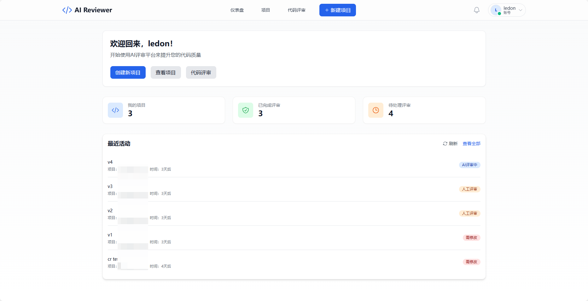

AIReview — AI-powered Code/Doc Review Platform
================================================

English | [简体中文](docs/README.zh-cn.md)

## Overview

AIReview is an AI-powered code review platform designed for development teams. It leverages artificial intelligence to automatically analyze code quality, generate review suggestions, and seamlessly integrates with Git workflows to significantly improve code review efficiency and quality.

Key Features:
- **AI-Driven Code Review**: Automatically analyze code quality, security risks, and best practices
- **Git Integration**: Support project import and code diff analysis  
- **Real-time Collaboration**: Real-time notifications and comments via SignalR
- **Multi-LLM Support**: Configurable AI model providers
- **Project Management**: Support project creation, member management, and permission control
- **Review Workflow**: Support review status management, approval/rejection processes

For high-level architecture, module responsibilities, and workflows, see:
- English design: docs/design.en-us.md
- Chinese design: docs/design.md

## Screenshots




## Repository Structure

- **AIReview.API**: ASP.NET Core Web API backend with controllers, hubs, and service configuration
- **AIReview.Core**: Core business logic with entity models, service interfaces, and business services  
- **AIReview.Infrastructure**: Infrastructure layer with EF Core data access, repository pattern, and background jobs
- **AIReview.Shared**: Shared Data Transfer Objects (DTOs) and enums
- **AIReview.Tests**: Unit tests and integration tests
- **aireviewer-frontend**: React + TypeScript frontend application built with Vite
- **docs**: Project documentation and design specifications

## Tech Stack

### Backend
- **.NET 8.0**: Modern cross-platform application development framework
- **ASP.NET Core Web API**: RESTful API services
- **Entity Framework Core**: Object-Relational Mapping (ORM)
- **ASP.NET Core Identity**: User authentication and authorization
- **SignalR**: Real-time bidirectional communication
- **SQLite**: Lightweight database (PostgreSQL configurable)
- **Background Jobs**: Asynchronous AI review processing

### Frontend
- **React 19**: Modern UI framework
- **TypeScript**: Type-safe JavaScript
- **Vite**: Fast frontend build tool
- **TailwindCSS**: Utility-first CSS framework
- **React Query**: Server state management
- **React Router**: Client-side routing
- **Axios**: HTTP client

## Prerequisites

- .NET SDK 8.0+
- Node.js 18+ and npm/pnpm (for frontend)
- SQLite (default) or PostgreSQL 14+ (optional)
- Optional: Redis (for caching and sessions), Docker Desktop

## Backend Setup and Running

1. **Configure Application Settings**: Configure in `AIReview.API/appsettings.Development.json`:
   ```json
   {
     "ConnectionStrings": {
       "DefaultConnection": "Data Source=aireviewer.db",  // SQLite
       "Redis": "localhost:6379"
     },
     "Jwt": {
       "Secret": "YourJWTSecretKey(AtLeast32Characters)",
       "Issuer": "AIReview", 
       "Audience": "AIReview"
     },
     "LLMProviders": {
       // Configure AI model providers
     }
   }
   ```

2. **Apply Database Migrations**:
   ```bash
   cd AIReview.API
   dotnet ef database update
   ```

3. **Start API Service**:
   ```bash
   dotnet run
   ```

## Frontend Setup and Running

1. **Install Dependencies**:
   ```bash
   cd aireviewer-frontend
   npm install
   ```

2. **Configure Environment Variables**: Create `.env` file:
   ```
   VITE_API_BASE_URL=http://localhost:5000
   ```

3. **Start Development Server**:
   ```bash
   npm run dev
   ```

## Tests

- Backend: place unit/integration tests under AIReview.Tests and run via the .NET test runner.
- Frontend: add tests using your preferred framework (e.g., Vitest) and run via package scripts.

## Deployment

- Containerize the API and frontend with multi-stage Docker builds
- Orchestrate with Kubernetes (Deployment/Service/Ingress)
- Externalize configuration and secrets via environment variables or a secret manager
- Set up metrics, logs, and tracing as needed

## Security

- JWT/OIDC-based auth with role- and resource-scoped permissions
- Input validation, output encoding, and rate limiting
- Encrypt data in transit and at rest; store secrets securely

## Roadmap (high level)

### Short-term Plans
- [ ] **PR Intelligent Summary Feature**
  - AI-generated Pull Request change summaries and impact analysis
  - Automatic identification of code change types (feature enhancement, bug fixes, refactoring, etc.)
  - Generate change risk assessments and recommended testing focus areas
  - Support semantic analysis of multi-language code changes
- [ ] GitHub/GitLab integration, IDE extensions (VS Code)
- [ ] Advanced AI suggestions and auto-fix proposals
- [ ] Support for more AI models (Claude, GPT-4, etc.)

### Medium-term Plans
- [ ] Team preference learning and rules adaptation
- [ ] Batch review and batch processing optimization
- [ ] Review reports and statistical analysis
- [ ] Mobile application support

### Long-term Vision
- [ ] Multi-tenant and enterprise policy controls
- [ ] Machine learning model optimization
- [ ] Open source community ecosystem development

## License

This project is licensed under the MIT License - see the [LICENSE](LICENSE) file for details.

## 相关文档

- High-level design (EN): docs/design.en-us.md
- 高层设计（中文）: docs/design.md
- 中文 README：docs/README.zh-cn.md
